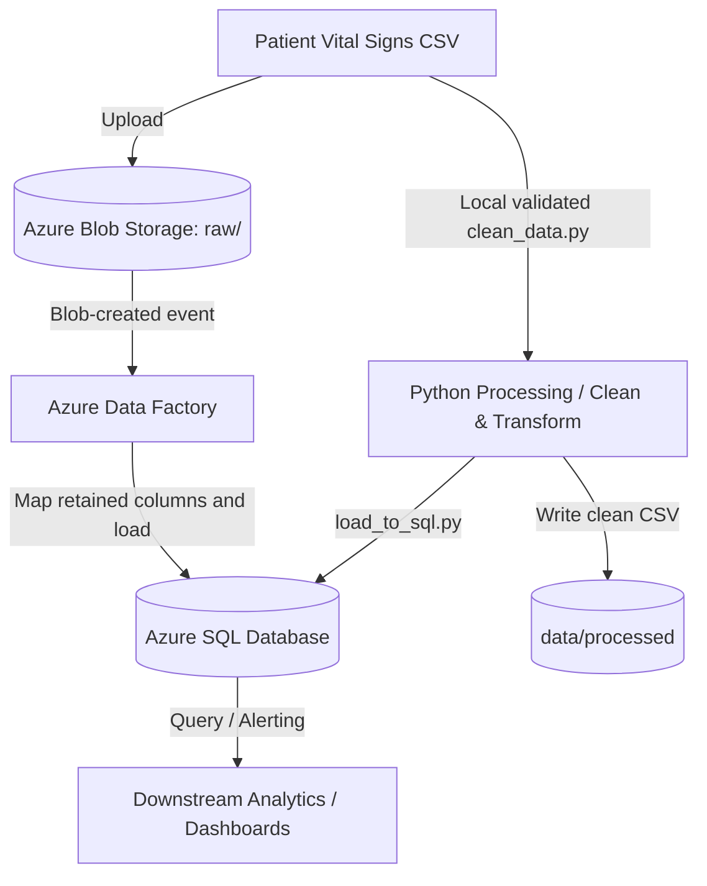

# Automated Post-Hospital Patient Monitoring System

An automated, enterprise-grade data engineering pipeline designed to ingest, clean, transform, and store post-hospital discharge patient vital signs for real-time patient monitoring and risk detection.

---

## 1. Project Overview & Business Value

When patients are discharged from the hospital, continuous monitoring of their vital signs (Heart Rate, Blood Pressure, Oxygen Saturation, etc.) is critical to preventing readmissions. 
This project builds an automated data pipeline to collect patient telemetry, clean and validate it, and ingest it into a central database. This allows medical personnel or dashboards to identify patients in the "High Risk" category quickly.

This is a **Data Engineering** project focusing on robust data pipelines, orchestration, and schema management. It is **not** a Machine Learning project.

---

## 2. Architecture & Data Flow



### Key Components:
1. **Data Ingestion**: Raw vital signs CSV files are uploaded to Azure Blob Storage (`raw/`).
2. **Orchestration**: Azure Data Factory (ADF) has an exported Blob event trigger and Copy Activity that maps the 14 retained fields into Azure SQL. Enable it only after a successful manual run.
3. **Data Cleaning & Transformation**: The Python pipeline validates schema, nulls, duplicates, value ranges, categories, timestamps, and column naming before creating the local clean CSV.
4. **Data Warehouse / Storage**: SQL scripts structure tables, write stored procedures, and load the clean records into Azure SQL Database.
5. **Configuration**: Environment variables are managed using `.env` files to prevent credentials from being committed to Git.

---

## 3. Directory Layout

The project folder structure is organized according to professional data engineering conventions:

```
├── config/             # Connection settings and environment files
├── data/               # Local data repository (ignored by Git)
│   ├── raw/            # Landing zone for raw incoming vital sign CSVs
│   └── processed/      # Storage for intermediate or clean processed files
├── docs/               # System documentation and data profiling reports
├── notebooks/          # Jupyter Notebooks for exploratory data analysis
├── sql/                # SQL scripts (DDL schema, indexes, DML)
├── src/                # Modular Python source code
│   ├── analysis/       # Business intelligence queries and summaries
│   ├── cleaning/       # Data validation and cleaning functions
│   ├── database/       # Database connection utility and load functions
│   ├── ingestion/      # Files download and landing scripts
│   ├── transformation/ # Schema conversion and feature extraction
│   └── utils/          # General helper functions and logging configs
├── tests/              # Pytest files for automated testing of ETL steps
├── .env.example        # Environment variable configuration template
├── .gitignore          # File exclusions list for Git
├── requirements.txt    # Python library dependencies
└── README.md           # This project document
```

---

## 4. Technology Stack

- **Language**: Python 3.12+ (Pandas, SQLAlchemy, PyODBC)
- **Database**: Azure SQL Database
- **Orchestration**: Azure Data Factory (ADF)
- **Cloud Storage**: Azure Blob Storage
- **Local Dev Tools**: VS Code, Git, Python venv

---

## 5. Local Setup and Execution

Follow these steps to set up the project locally:

### Prerequisites
Make sure you have **Python 3.12+** and **Git** installed on your machine.

### 1. Clone the Repository
```bash
git clone <repository-url>
cd depi-grad
```

### 2. Configure Virtual Environment
Create and activate a Python virtual environment:
```bash
# Create the virtual environment
python -m venv .venv

# Activate it (Windows PowerShell)
.\.venv\Scripts\Activate.ps1

# Activate it (Windows Command Prompt)
.\.venv\Scripts\activate.bat

# Activate it (Linux/macOS)
source .venv/bin/activate
```

### 3. Install Dependencies
Install the required libraries:
```bash
pip install -r requirements.txt
```

Run the automated checks after installation:

```bash
python -m pytest -q
```

The `.venv` directory is machine-specific and must not be copied between machines. If its Python executable no longer exists, delete it and recreate it with the commands above.

### 4. Setup Local Configurations
Copy the environment variables template and configure it with your credentials:
```bash
cp .env.example .env
```
Edit the newly created `.env` file to match your database connections and storage accounts.

---

## 6. Database Layer

The `sql/` directory contains all scripts required to deploy and interact with the production SQL database. All scripts target **Azure SQL Database** and are written in standard T-SQL.

### SQL Scripts

| File | Purpose |
| :--- | :--- |
| `sql/create_patient_vitals.sql` | Creates the production table `dbo.patient_vitals`. Run once during initial deployment or after a drop. |
| `sql/drop_patient_vitals.sql` | Safely drops `dbo.patient_vitals` if it exists. Includes an existence check to prevent errors. Run before re-deploying the create script. |
| `sql/queries.sql` | 10 analytical SELECT queries for initial data exploration and validation after loading. |

### Table Schema: `dbo.patient_vitals`

The table stores one row per telemetry reading. A surrogate `record_id` serves as the Primary Key. The `patient_id` column carries the original source patient identifier.

| Column | SQL Type | Description |
| :--- | :--- | :--- |
| `record_id` | `INT IDENTITY(1,1)` | Auto-increment surrogate Primary Key |
| `patient_id` | `INT NOT NULL` | Source patient identifier |
| `measured_at` | `DATETIME2(6) NOT NULL` | Microsecond-precision measurement timestamp |
| `heart_rate` | `SMALLINT NOT NULL` | Heart rate in bpm (range 60–99) |
| `respiratory_rate` | `SMALLINT NOT NULL` | Respiratory rate in breaths/min (range 12–19) |
| `body_temperature` | `DECIMAL(4,2) NOT NULL` | Body temperature in °C (range 36.00–37.50) |
| `oxygen_saturation` | `DECIMAL(5,2) NOT NULL` | SpO2 in % (range 95.00–100.00) |
| `systolic_bp` | `SMALLINT NOT NULL` | Systolic blood pressure in mmHg (range 110–139) |
| `diastolic_bp` | `SMALLINT NOT NULL` | Diastolic blood pressure in mmHg (range 70–89) |
| `hrv` | `DECIMAL(5,4) NOT NULL` | Heart Rate Variability sensor reading |
| `age` | `SMALLINT NOT NULL` | Patient age in years (range 18–89) |
| `gender` | `VARCHAR(10) NOT NULL` | Patient gender (`'Male'` or `'Female'`) |
| `weight_kg` | `DECIMAL(5,2) NOT NULL` | Patient weight in kg (range 50.00–99.99) |
| `height_m` | `DECIMAL(3,2) NOT NULL` | Patient height in metres (range 1.50–2.00) |
| `risk_category` | `VARCHAR(20) NOT NULL` | Clinical alarm state (`'High Risk'` or `'Low Risk'`) |
| `ingested_at` | `DATETIME2 DEFAULT SYSUTCDATETIME()` | Audit column: UTC time the row was loaded |

### Deployment Order

To deploy the schema from scratch, execute the scripts in this order:

```sql
-- Step 1: (Optional) Reset the table if it already exists
-- sql/drop_patient_vitals.sql

-- Step 2: Create the production table
-- sql/create_patient_vitals.sql

-- Step 3: (After loading data) Run analytical queries
-- sql/queries.sql
```

---

## 7. Loading Data into Azure SQL

The script `src/database/load_to_sql.py` reads the cleaned dataset and bulk-loads it into the `dbo.patient_vitals` table using SQLAlchemy and pyodbc batch inserts.

### Prerequisites

- The `dbo.patient_vitals` table must already exist in Azure SQL (run `sql/create_patient_vitals.sql` first).
- The cleaned dataset must exist at `data/processed/patient_vitals_clean.csv` (run `src/cleaning/clean_data.py` first).
- ODBC Driver 18 for SQL Server must be installed on the machine running the script.

### Required Environment Variables

Set these four variables in your `.env` file before running the script:

| Variable | Description | Example |
| :--- | :--- | :--- |
| `AZURE_SQL_SERVER` | Full Azure SQL server hostname | `myserver.database.windows.net` |
| `AZURE_SQL_DATABASE` | Target database name | `patient_monitoring_db` |
| `AZURE_SQL_USERNAME` | SQL authentication username | `sqladmin` |
| `AZURE_SQL_PASSWORD` | SQL authentication password | `Str0ngP@ssword!` |

### How to Run

Activate the virtual environment, then run the script from the project root:

```bash
# Windows PowerShell
.\.venv\Scripts\Activate.ps1
python src/database/load_to_sql.py
```

```bash
# Linux / macOS
source .venv/bin/activate
python src/database/load_to_sql.py
```

### Expected Output

```
Loading cleaned dataset from: .../data/processed/patient_vitals_clean.csv
Dataset loaded successfully. Shape: 200,020 rows x 14 columns.
Aligning DataFrame column names with the SQL table schema...
Column alignment complete.
Establishing connection to Azure SQL Database...
Database connection established successfully.

Starting batch insert into [patient_vitals] (batch size: 10,000 rows)...
------------------------------------------------------------
Inserted 10,000 rows...
Inserted 20,000 rows...
Inserted 30,000 rows...
...
Inserted 200,020 rows...
------------------------------------------------------------
Data successfully loaded into patient_vitals.
Total rows inserted: 200,020
```

### Error Handling

The script handles the three most common failure modes and prints a clear, actionable error message for each:

| Error | Message Shown | Resolution |
| :--- | :--- | :--- |
| Missing environment variable | Lists which variables are not set | Fill in `.env` with correct credentials |
| CSV file not found | States the expected file path | Run `src/cleaning/clean_data.py` first |
| Database connection failure | States the connection error details | Check server name, credentials, and firewall rules |
| SQL execution error | States the SQL error after N rows inserted | Verify table schema matches `create_patient_vitals.sql` |

The database schema also protects against duplicate `(patient_id, measured_at)` records and invalid gender, risk-category, and oxygen-saturation values. A repeated ADF event should be investigated rather than retried blindly.

---

## 8. Azure Deployment

The full step-by-step deployment guide is available at:

📄 **[docs/azure_sql_deployment.md](docs/azure_sql_deployment.md)**

### Quick-Reference Checklist

Follow these steps in order to deploy to Azure SQL Database:

| Step | Action | File / Tool |
| :---: | :--- | :--- |
| 1 | Create Azure SQL Server and Database | Azure Portal |
| 2 | Add your IP to the firewall rules | Azure Portal → Networking |
| 3 | Copy server name from the Portal Overview | Azure Portal |
| 4 | Configure credentials in `.env` | `.env` (from `.env.example`) |
| 5 | Create the production table | `sql/create_patient_vitals.sql` |
| 6 | Load the cleaned dataset | `python src/database/load_to_sql.py` |
| 7 | Verify row count and data quality | `sql/verification_queries.sql` |

### SQL Files Reference

| File | Purpose |
| :--- | :--- |
| `sql/create_patient_vitals.sql` | Creates the `dbo.patient_vitals` table in Azure SQL |
| `sql/drop_patient_vitals.sql` | Safely drops the table (use before re-deploying) |
| `sql/verification_queries.sql` | 5 post-load checks: row count, top 10, risk counts, timestamp range |
| `sql/queries.sql` | 10 analytical queries for data exploration |

### Required Environment Variables

| Variable | Description |
| :--- | :--- |
| `AZURE_SQL_SERVER` | Full server hostname, e.g. `myserver.database.windows.net` |
| `AZURE_SQL_DATABASE` | Database name |
| `AZURE_SQL_USERNAME` | SQL admin login name |
| `AZURE_SQL_PASSWORD` | SQL admin password |

## 9. Deployment Evidence

Do not mark cloud deployment complete solely because the ARM templates exist. Record the ADF run ID, Azure SQL verification-query output, and the exact deployed template version in [docs/deployment_evidence.md](docs/deployment_evidence.md). The ADF event trigger is exported disabled and should be started only after this evidence is captured.

## 10. Dynamic Data Simulation

The project now supports both historical batch processing and simulated live patient monitoring. The historical dataset and existing ETL pipeline remain unchanged. The simulator creates realistic readings in the existing 14-column cleaned-data schema and appends them to a separate local CSV.

```text
Live Patient Data Generator (Python)
        ↓ every 5 seconds
data/live/live_patient_data.csv
```

Run the continuous simulator from the project root:

```bash
python src/simulator/patient_data_generator.py
```

For a finite local demonstration, generate three records without a delay:

```bash
python src/simulator/patient_data_generator.py --count 3 --interval 0
```

It does not upload data to Azure, modify the historical dataset, or alter the current ETL flow. See [docs/dynamic_data_generation.md](docs/dynamic_data_generation.md) for field details and integration boundaries.
