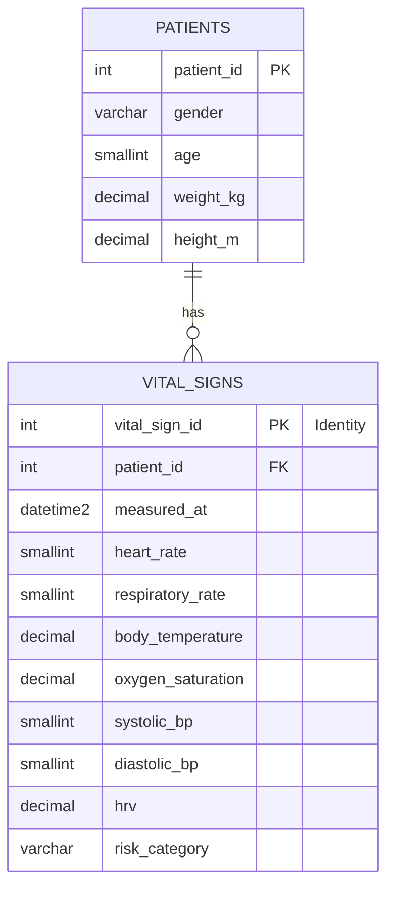

# Data Quality Assessment & Schema Design Report
**Project**: Automated Post-Hospital Patient Monitoring System  
**Role**: Senior Data Engineer  
**Status**: Approved — Column audit and cleaning recommendations (Section 1–2) are fully implemented.
The normalized two-table schema in Section 3 was evaluated as a design alternative; the project
proceeded with the flat single-table design (`dbo.patient_vitals`, see `sql/create_patient_vitals.sql`)
for this delivery. The normalized model is retained below as a documented **future improvement**
(see also Section 17, "Possible Future Improvements," in the Final Project Guide).

---

## Executive Summary

Before building any ETL pipeline or database structures in Azure, a rigorous data quality audit was conducted on the raw landing dataset `human_vital_signs_dataset_2024.csv`. 

Our findings indicate that the dataset is highly clean (no missing values, no duplicates) but contains **redundant derived columns** that violate basic database normalization principles (Third Normal Form / 3NF). Additionally, the schema conflates static patient attributes (demographics) with transient telemetry (vitals), which represents poor data modeling.

This assessment proposes a normalized, production-grade schema for Azure SQL Database, transition to standard naming conventions (`snake_case`), and optimized data types.

---

## 1. Column-by-Column Audit Recommendations

| Raw Column Name | Recommendation | Target Name | Target SQL Type | Justification |
| :--- | :--- | :--- | :--- | :--- |
| `Patient ID` | **Keep** | `patient_id` | `INT` | Unique identifier. Serves as Primary Key (PK) for patients. |
| `Heart Rate` | **Keep** | `heart_rate` | `SMALLINT` | Core vital telemetry. Value range (60-99) fits in `SMALLINT` (2 bytes) to optimize storage. |
| `Respiratory Rate` | **Keep** | `respiratory_rate` | `SMALLINT` | Core vital telemetry. Value range (12-19) fits in `SMALLINT`. |
| `Timestamp` | **Keep & Cast** | `measured_at` | `DATETIME2` | Represents when the reading was taken. Needs conversion from text to datetime for time-series queries. |
| `Body Temperature` | **Keep** | `body_temperature` | `DECIMAL(4,2)` | Core vital telemetry. Range (36.00-37.50). `DECIMAL(4,2)` preserves exact precision without floating-point errors. |
| `Oxygen Saturation` | **Keep** | `oxygen_saturation` | `DECIMAL(5,2)` | Core vital telemetry. Range (95.00-100.00). `DECIMAL(5,2)` is precise and fits all values. |
| `Systolic Blood Pressure` | **Keep** | `systolic_bp` | `SMALLINT` | Vital sign. Renamed to standard clinical abbreviation. Fits in `SMALLINT`. |
| `Diastolic Blood Pressure` | **Keep** | `diastolic_bp` | `SMALLINT` | Vital sign. Renamed to standard clinical abbreviation. Fits in `SMALLINT`. |
| `Age` | **Keep** | `age` | `SMALLINT` | Patient demographic. Fits in `SMALLINT`. |
| `Gender` | **Keep** | `gender` | `VARCHAR(10)` | Patient demographic. Only contains "Male" and "Female". |
| `Weight (kg)` | **Keep** | `weight_kg` | `DECIMAL(5,2)` | Patient demographic/physical metric. Removed parentheses for clean SQL. Range (50.00-99.99). |
| `Height (m)` | **Keep** | `height_m` | `DECIMAL(3,2)` | Patient demographic/physical metric. Removed parentheses. Range (1.50-2.00). |
| `Derived_HRV` | **Keep & Rename**| `hrv` | `DECIMAL(5,4)` | Telemetry metric (Heart Rate Variability). Kept because HRV is a complex wave-analysis metric that cannot be reverse-engineered from average Heart Rate. Prefix `Derived_` removed. |
| `Derived_Pulse_Pressure` | **Remove** | — | — | **Redundant**. Directly calculated as: $Systolic - Diastolic$. |
| `Derived_BMI` | **Remove** | — | — | **Redundant**. Directly calculated as: $Weight / Height^2$. |
| `Derived_MAP` | **Remove** | — | — | **Redundant**. Mean Arterial Pressure is calculated as: $Diastolic + \frac{Systolic - Diastolic}{3}$. |
| `Risk Category` | **Keep** | `risk_category` | `VARCHAR(20)` | Clinical alarm state. Kept as the official categorization log. |

---

## 2. Detailed Quality & Design Analysis

### Q1 & Q2: Columns to Keep vs. Remove
* **Keep**: Standard raw measurements, demographic characteristics, and complex telemetry (`Derived_HRV`, renamed to `hrv`).
* **Remove**: `Derived_Pulse_Pressure`, `Derived_BMI`, and `Derived_MAP`. 
* **Why?**: Storing calculated fields directly in a transactional database table introduces **data redundancy and write-anomaly risks**. For example, if a cleaning step updates a typo in `Systolic Blood Pressure`, the corresponding `Derived_MAP` would become out of sync unless manually re-calculated. In data engineering, derived metrics are calculated at the reporting/consumption layer or via database views to ensure a single source of truth.

### Q3 & Q6: Renaming & Naming Conventions (`snake_case`)
We recommend renaming all columns to **`snake_case`**. 
* **Justification**: 
  1. Standardizing on `snake_case` avoids syntax issues with SQL (e.g., having to wrap `Patient ID` or `Weight (kg)` in brackets `[Patient ID]` or quotes `"`).
  2. Ensures consistency with Python variables (PEP 8) during the ingestion and clean/transform scripting phase.
  3. Avoids formatting failures in ADF mapping schemas.

### Q4 & Q5: Datatype Conversions & Datetime Casts
* **Timestamp**: Currently stored as a generic string/object (`2024-07-19 21:53:45.729841`). It will be cast to a high-precision `DATETIME2` in Azure SQL. This enables indexed time-window queries, partitioning, and standard datetime functions (`DATEDIFF`, `DATEADD`).
* **Vitals to Integers**: Metrics like Heart Rate and Blood Pressure are natural integer counts. Using `SMALLINT` (2 bytes) instead of standard `INT` (4 bytes) or `BIGINT` (8 bytes) saves storage over millions of records.
* **Float to Decimals**: Using binary floating-point representation (`FLOAT` in SQL or `float64` in python) can lead to rounding errors. Physical characteristics (`Weight`, `Height`, `Body Temperature`, `Oxygen Saturation`, `HRV`) should be stored as fixed-point `DECIMAL` types to ensure arithmetic accuracy.

### Q7: Derived Columns Status
As outlined above, `Derived_Pulse_Pressure`, `Derived_BMI`, and `Derived_MAP` are 100% redundant. Their values are computed using basic arithmetic from other fields in the same row. They will be excluded from the database tables, and instead computed dynamically using a **SQL View** (`dbo.v_patient_vitals_summary`).

---

## 3. Production Azure SQL Database Schema (Design Alternative — Not Implemented in This Delivery)

> **Implementation note**: The design below was evaluated as a fully normalized alternative. For
> this project delivery, the team implemented the **flat single-table design** instead
> (`dbo.patient_vitals`, defined in `sql/create_patient_vitals.sql`), since the dataset represents a
> single ingestion batch with no repeated-measurement update scenarios that would require the
> stricter normalization below. The flat design was deployed to Azure SQL Database, populated with
> all 200,020 records via the Azure Data Factory Copy Activity pipeline, and verified. The
> normalized model documented in this section remains a valid recommendation for a future phase
> if the system evolves to support multiple longitudinal readings per patient with independent
> demographic updates (see Section 17, "Possible Future Improvements," in the Final Project Guide).

To implement a fully normalized relational model, one could split the flat CSV file into two tables to separate patient-specific facts (dimension) from measurement events (fact). This would be more scalable if a patient is monitored over several days, generating multiple vital records with demographic data that only needs to be stored once.



### DDL Implementation Plan

#### Table 1: Patient Dimension (`dbo.patients`)
Stores relatively static attributes of the patient.
```sql
CREATE TABLE dbo.patients (
    patient_id INT NOT NULL,
    gender VARCHAR(10) NOT NULL,
    age SMALLINT NOT NULL,
    weight_kg DECIMAL(5, 2) NOT NULL,
    height_m DECIMAL(3, 2) NOT NULL,
    created_at DATETIME2 CONSTRAINT DF_patients_created DEFAULT SYSUTCDATETIME(),
    
    CONSTRAINT PK_patients PRIMARY KEY CLUSTERED (patient_id)
);
```

#### Table 2: Vital Signs Fact (`dbo.vital_signs`)
Stores the actual time-series telemetry events for the patients.
```sql
CREATE TABLE dbo.vital_signs (
    vital_sign_id INT IDENTITY(1,1) NOT NULL,
    patient_id INT NOT NULL,
    measured_at DATETIME2 NOT NULL,
    heart_rate SMALLINT NOT NULL,
    respiratory_rate SMALLINT NOT NULL,
    body_temperature DECIMAL(4, 2) NOT NULL,
    oxygen_saturation DECIMAL(5, 2) NOT NULL,
    systolic_bp SMALLINT NOT NULL,
    diastolic_bp SMALLINT NOT NULL,
    hrv DECIMAL(5, 4) NOT NULL,
    risk_category VARCHAR(20) NOT NULL,
    ingested_at DATETIME2 CONSTRAINT DF_vital_signs_ingested DEFAULT SYSUTCDATETIME(),

    CONSTRAINT PK_vital_signs PRIMARY KEY CLUSTERED (vital_sign_id),
    CONSTRAINT FK_vital_signs_patients FOREIGN KEY (patient_id) REFERENCES dbo.patients (patient_id)
);

-- Indexing for rapid queries based on patient and timestamp
CREATE NONCLUSTERED INDEX IX_vital_signs_patient_measured 
ON dbo.vital_signs (patient_id, measured_at);
```

#### Calculated Summary View (`dbo.v_patient_vitals_summary`)
Provides downstream applications and BI dashboards with all fields, including the derived calculations dynamically computed on query execution.
```sql
CREATE VIEW dbo.v_patient_vitals_summary AS
SELECT 
    p.patient_id,
    p.gender,
    p.age,
    p.weight_kg,
    p.height_m,
    v.vital_sign_id,
    v.measured_at,
    v.heart_rate,
    v.respiratory_rate,
    v.body_temperature,
    v.oxygen_saturation,
    v.systolic_bp,
    v.diastolic_bp,
    v.hrv,
    v.risk_category,
    -- Dynamic derivations:
    (v.systolic_bp - v.diastolic_bp) AS pulse_pressure,
    CAST(p.weight_kg / POWER(p.height_m, 2) AS DECIMAL(5, 2)) AS bmi,
    CAST(v.diastolic_bp + ((v.systolic_bp - v.diastolic_bp) / 3.0) AS DECIMAL(5, 2)) AS MAP
FROM dbo.patients p
INNER JOIN dbo.vital_signs v ON p.patient_id = v.patient_id;
```

---

## 4. Next Steps & Phase Closure

This concludes the Data Quality Assessment.
1. **Reviewed and Approved**: The omission of the three redundant derived columns (`Derived_BMI`,
   `Derived_MAP`, `Derived_Pulse_Pressure`) and the `snake_case` renaming convention were approved
   and implemented. The flat single-table design was selected over the normalized two-table design
   for this delivery (see the implementation note in Section 3).
2. **ETL & Cleaning — Completed**: The Python cleaning script (`src/cleaning/clean_data.py`) processes
   the raw CSV, drops the redundant columns, renames columns to `snake_case`, casts the timestamp to
   `datetime64[ns]`, and writes the cleaned dataset to `data/processed/patient_vitals_clean.csv`.
3. **Azure Deployment — Completed**: The `dbo.patient_vitals` table was deployed to Azure SQL
   Database and populated with all 200,020 cleaned records via the Azure Data Factory Copy Activity
   pipeline (`pl_copy_raw_to_sql`). Row count and `risk_category` distribution were verified against
   this report's expected values.